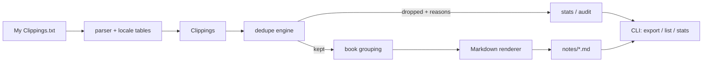

# clipshelf

[English](README.md) | [中文](README.zh.md) | [日本語](README.ja.md)

[](LICENSE) [](CHANGELOG.md) [](pyproject.toml)  [](CONTRIBUTING.md)

**オープンソースの Kindle ハイライト解放ツール——'My Clippings.txt' を書籍ごとの整った Markdown ノートに変換し、重なり合うハイライトの修正版を重複排除、完全オフライン。**


```bash
git clone https://github.com/JaydenCJ/clipshelf && cd clipshelf && pip install -e .
```

> **プレリリース：** clipshelf はまだ PyPI に公開されていません。最初のリリースまでは [JaydenCJ/clipshelf](https://github.com/JaydenCJ/clipshelf) をクローンし、リポジトリのルートで `pip install -e .` を実行してください。

## なぜ clipshelf？

Kindle は何年分ものハイライトを 1 つのプレーンテキストに溜め込み——決して掃除しません。ハイライトの端をずらして一文追加するだけで、端末は*完全な新エントリを追記*します。3 回直せば、ほぼ同一のエントリが 4 つ並びます。既存の分割スクリプトは `==========` 区切りで切るだけで、古い修正版をそのままノートに写します。Readwise は解決してくれますが、月額課金とクラウドへのアップロードが条件です。clipshelf はこれを本来の姿——パース問題として扱います：エントリを書籍ごとにまとめ、位置範囲の重なりと正規化テキストの包含関係で修正版を検出し、最終版だけを残し、決定的な Markdown を出力します。ハイライトはあなたのマシンから一歩も出ません。

|  | clipshelf | Readwise | Clippings.io | 素朴な分割スクリプト |
|---|---|---|---|---|
| 重なり合うハイライト修正版の重複排除 | あり（オフライン、理由を監査可能） | あり（クラウド側） | 部分的（完全一致のみ） | なし |
| オフライン動作 / データはローカルに残る | はい | いいえ（アップロード + アカウント） | いいえ（アップロード） | はい |
| 価格 | 無料、MIT | 月額 $4.49–5.59 | 無料枠 + 有料エクスポート | 無料 |
| 2011 年以前のファームウェアの癖（`Loc. 351-52`、ローマ数字ページ） | 対応 | 記載なし | 記載なし | ほぼ非対応 |
| 1 ファイル内の複数端末言語の混在 | 8 言語を一括パース | 対応 | 英語中心 | 英語の正規表現のみ |
| ランタイム依存 | 0 | SaaS | SaaS | まちまち |

<sub>Readwise の価格は 2026-07 時点で公表されている Lite/Full の月額。clipshelf の依存数は [pyproject.toml](pyproject.toml) の `dependencies = []` のとおり。</sub>

## 特徴

- **修正版を理解する重複排除** — 延長・短縮・両端移動されたハイライトを、位置の重なり + 正規化テキストの包含 + 最長共通部分の比率で最終版へ折りたたみ。削除は必ず理由付きで記録（`identical` / `contained` / `revised`）。
- **誠実な生存者選択** — どの修正版が最新かはタイムスタンプが決め、追記順がフォールバック。後からの意図的な短縮は、時計が証明する場合にのみ「長いテキストを残す」既定を覆します。
- **8 つの端末言語を一括パース** — 英語・スペイン語・フランス語・ドイツ語・イタリア語・ポルトガル語・中国語・日本語のメタデータ行を、フラグなしで同一ファイルからパース。実際のファイルは言語切替後に混在するからです。
- **年季の入ったファイルもそのまま動く** — UTF-8 BOM と UTF-16、CRLF、2011 年以前の省略範囲 `Loc. 351-52`（`351-352` に展開）、ローマ数字ページ、そしてクラッシュではなく警告に降格する壊れたエントリ。
- **メモは対応するハイライトの下へ** — ハイライトの位置範囲内にアンカーされたメモは、その引用の直下に描画され、宙に浮いた孤児にはなりません。
- **決定的な Markdown** — 同じ入力ならバイト単位で同じ出力：読書順ソート、Unicode を保つ安定スラッグ（`こころ.md`）、衝突時の連番付与。エクスポートは git で綺麗に diff できます。
- **ランタイム依存ゼロ** — 純粋な Python 標準ライブラリのみ。ネットワーク呼び出しなし、テレメトリなし、設定不要。

## クイックスタート

インストール：

```bash
git clone https://github.com/JaydenCJ/clipshelf && cd clipshelf && pip install -e .
```

Kindle 上の clippings ファイル（例：`/media/kindle/documents/` にマウント）を指定するか、同梱のサンプルで試してください：

```bash
clipshelf export "examples/My Clippings.txt" -o notes
```

```text
wrote notes/how-to-read-a-book.md (2 highlights, 1 note, 2 duplicates removed)
wrote notes/meditations.md (2 highlights, 1 duplicate removed)
wrote notes/cien-años-de-soledad.md (1 highlight)
wrote notes/こころ.md (1 highlight)
4 books, 6 highlights, 1 note, 3 duplicates removed
```

重複排除を信頼する前に、何をしたか確認：

```bash
clipshelf list "examples/My Clippings.txt"
```

```text
TITLE                 HIGHLIGHTS  NOTES  DUPES
How to Read a Book             2      1      2
Meditations                    2      0      1
Cien años de soledad           1      0      0
こころ                            1      0      0
```

上の 2 つの出力はどちらも [`examples/My Clippings.txt`](examples/) への実際の実行から採取したものです。`--no-dedupe` で全修正版を保持、`--dry-run` で書き込まずにプレビュー、`list`/`stats` の `--json` でスクリプト処理向け出力になります。

## CLI リファレンス

| コマンド | 用途 |
|---|---|
| `clipshelf export <file> [-o DIR]` | 書籍ごとに Markdown ファイルを書き出す（既定 `notes/`） |
| `clipshelf list <file>` | ハイライト/メモ/重複数つきの書籍一覧 |
| `clipshelf stats <file>` | ファイル全体の集計、重複は理由別に内訳 |

| フラグ | 既定値 | 効果 |
|---|---|---|
| `--no-dedupe` | オフ | 重なり合う修正版を含め、全エントリをそのまま保持 |
| `--overlap-ratio R` | `0.6` | 重なった 2 つのハイライトを統合する最小共有テキスト比率 |
| `--book SUBSTRING` | 全部 | タイトルに SUBSTRING を含む書籍のみエクスポート |
| `--include-bookmarks` | オフ | 各ファイルに Bookmarks セクションを追加 |
| `--no-location` / `--no-date` | オフ | 出力から位置番号 / タイムスタンプを省略 |
| `--dry-run` | オフ | 書き込む内容を報告するだけで何も触らない |
| `--json` | オフ | `list` と `stats` を機械可読形式で出力 |

## 重複排除のルール

2 つのハイライトが統合されるのは、位置範囲が重なり**かつ**正規化テキストが関連する場合のみ：完全一致、一方が他方を包含、または共通部分が短い方の `--overlap-ratio` 以上。範囲が離れていれば決して統合しません——同じ一文を二つの章でハイライトすれば、それは 2 つのハイライトです。メモはユーザー自身の言葉なので完全一致の重複だけを除去し、パーサが分類できなかったエントリは手つかずで通過します。意図的な短縮の例外を含む完全なルールは [docs/clippings-format.md](docs/clippings-format.md) に規定しています。

## 検証

このリポジトリは CI を同梱しません。上記の主張はすべてローカル実行で検証しています。このリポジトリのチェックアウトから再現：

```bash
pip install -e '.[dev]' && pytest && bash scripts/smoke.sh
```

出力（実際の実行からコピー、`...` で省略）：

```text
91 passed in 0.51s
...
[export] 4 books, 6 highlights, 1 note, 3 duplicates removed
SMOKE OK
```

## アーキテクチャ



## ロードマップ

- [x] 寛容な多言語パーサ、修正版を折りたたむ重複排除エンジン、決定的な書籍別 Markdown エクスポート、`export`/`list`/`stats` CLI（v0.1.0）
- [ ] PyPI 公開、`pip install clipshelf` 対応
- [ ] 増分エクスポート：clippings が変わった書籍だけを書き直す
- [ ] Org-mode と JSON のエクスポート形式
- [ ] 複数端末の複数 clippings ファイルの統合ヘルパー

全リストは [open issues](https://github.com/JaydenCJ/clipshelf/issues) を参照してください。

## コントリビュート

コントリビューション歓迎です——まずは [good first issue](https://github.com/JaydenCJ/clipshelf/issues?q=is%3Aissue+is%3Aopen+label%3A%22good+first+issue%22) から、または [discussion](https://github.com/JaydenCJ/clipshelf/discussions) を立ててください。開発環境の構築は [CONTRIBUTING.md](CONTRIBUTING.md) を参照。

## ライセンス

[MIT](LICENSE)
