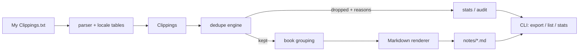

# clipshelf

[English](README.md) | [中文](README.zh.md) | [日本語](README.ja.md)

[](LICENSE) [](CHANGELOG.md) [](pyproject.toml)  [](CONTRIBUTING.md)

**Open-source Kindle highlight liberation — turn 'My Clippings.txt' into clean per-book Markdown notes, deduplicating overlapping highlight revisions, fully offline.**


```bash
git clone https://github.com/JaydenCJ/clipshelf && cd clipshelf && pip install -e .
```

> **Pre-release:** clipshelf is not yet published to PyPI. Until the first release, clone [JaydenCJ/clipshelf](https://github.com/JaydenCJ/clipshelf) and run `pip install -e .` from the repository root.

## Why clipshelf?

Every Kindle keeps years of your highlights in one plain-text file — and never cleans it. Nudge a highlight's edge to grab one more sentence and the device *appends a second full copy*; do it three times and the file holds four near-identical entries. Existing splitter scripts cut the file at the `==========` separators and faithfully copy every stale revision into your notes, while Readwise fixes it behind a monthly subscription and a cloud upload. clipshelf treats this as what it is — a parsing problem: it groups entries per book, detects revisions by location-range overlap plus normalized-text containment, keeps only the final version, and writes deterministic Markdown. Your highlights never leave your machine.

|  | clipshelf | Readwise | Clippings.io | naive splitter scripts |
|---|---|---|---|---|
| Dedupes overlapping highlight revisions | Yes (offline, auditable reasons) | Yes (cloud-side) | Partial (exact repeats) | No |
| Works offline / data stays local | Yes | No (upload + account) | No (upload) | Yes |
| Price | Free, MIT | $4.49–5.59/month | Free tier + paid export | Free |
| Pre-2011 firmware quirks (`Loc. 351-52`, roman pages) | Yes | Undocumented | Undocumented | Rarely |
| Mixed device languages in one file | 8 locales, one pass | Yes | English-centric | English-only regex |
| Runtime dependencies | 0 | SaaS | SaaS | varies |

<sub>Readwise pricing is the published Lite/Full monthly rate as of 2026-07. clipshelf's dependency count is `dependencies = []` in [pyproject.toml](pyproject.toml).</sub>

## Features

- **Revision-aware dedupe** — extended, trimmed, and moved-both-edges highlights collapse to the final version via location overlap + normalized-text containment + longest-common-run ratio; every removal is recorded with a reason (`identical` / `contained` / `revised`).
- **Honest survivor choice** — timestamps decide which revision is newest; append order is the fallback; and a deliberate later trim beats "keep the longer text" only when the clock proves it.
- **Eight device languages, one pass** — English, Spanish, French, German, Italian, Portuguese, Chinese, Japanese metadata lines parse from a single file with no flags, because real files mix locales after a language switch.
- **Years-old files just work** — UTF-8 BOM and UTF-16 encodings, CRLF, pre-2011 `Loc. 351-52` abbreviated ranges (expanded to `351-352`), roman-numeral pages, and malformed entries that degrade to warnings instead of crashes.
- **Notes land under their highlight** — a note anchored inside a highlight's location range renders beneath that quote, not as a floating orphan.
- **Deterministic Markdown** — same input, byte-identical output: sorted reading order, stable Unicode-preserving slugs (`こころ.md`), collision-numbered filenames; exports diff cleanly in git.
- **Zero runtime dependencies** — pure Python standard library; no network calls, no telemetry, nothing to configure.

## Quickstart

Install:

```bash
git clone https://github.com/JaydenCJ/clipshelf && cd clipshelf && pip install -e .
```

Point it at the clippings file on your Kindle (mounted at e.g. `/media/kindle/documents/`), or try the shipped example:

```bash
clipshelf export "examples/My Clippings.txt" -o notes
```

```text
wrote notes/how-to-read-a-book.md (2 highlights, 1 note, 2 duplicates removed)
wrote notes/meditations.md (2 highlights, 1 duplicate removed)
wrote notes/cien-años-de-soledad.md (1 highlight)
wrote notes/こころ.md (1 highlight)
4 books, 6 highlights, 1 note, 3 duplicates removed
```

See what dedupe did before trusting it:

```bash
clipshelf list "examples/My Clippings.txt"
```

```text
TITLE                 HIGHLIGHTS  NOTES  DUPES
How to Read a Book             2      1      2
Meditations                    2      0      1
Cien años de soledad           1      0      0
こころ                            1      0      0
```

Both outputs above are captured from a real run against [`examples/My Clippings.txt`](examples/). Add `--no-dedupe` to keep every raw revision, `--dry-run` to preview without writing, and `--json` on `list`/`stats` for scripting.

## CLI reference

| Command | Purpose |
|---|---|
| `clipshelf export <file> [-o DIR]` | write one Markdown file per book (default `notes/`) |
| `clipshelf list <file>` | table of books with highlight/note/duplicate counts |
| `clipshelf stats <file>` | file-wide totals, duplicates broken down by reason |

| Flag | Default | Effect |
|---|---|---|
| `--no-dedupe` | off | keep every raw entry, including overlapping revisions |
| `--overlap-ratio R` | `0.6` | minimum shared-text ratio for two overlapping highlights to merge |
| `--book SUBSTRING` | all | export only books whose title contains SUBSTRING |
| `--include-bookmarks` | off | add a Bookmarks section to each file |
| `--no-location` / `--no-date` | off | omit location numbers / timestamps from the output |
| `--dry-run` | off | report what would be written, touch nothing |
| `--json` | off | machine-readable output for `list` and `stats` |

## Dedupe rules

Two highlights merge only when their location ranges overlap **and** their normalized texts are related: identical, one contained in the other, or sharing a common run of at least `--overlap-ratio` of the shorter text. Disjoint ranges never merge — the same sentence highlighted in two chapters is two highlights. Notes are the user's own words and only lose exact repeats; entries the parser could not classify pass through untouched. The full rules, including the deliberate-trim exception, are specified in [docs/clippings-format.md](docs/clippings-format.md).

## Verification

This repository ships no CI; every claim above is verified by local runs. Reproduce them from a checkout of this repository:

```bash
pip install -e '.[dev]' && pytest && bash scripts/smoke.sh
```

Output (copied from a real run, truncated with `...`):

```text
91 passed in 0.51s
...
[export] 4 books, 6 highlights, 1 note, 3 duplicates removed
SMOKE OK
```

## Architecture



## Roadmap

- [x] Forgiving multi-locale parser, revision-collapsing dedupe engine, deterministic per-book Markdown export, `export`/`list`/`stats` CLI (v0.1.0)
- [ ] PyPI release with `pip install clipshelf`
- [ ] Incremental export: only rewrite books whose clippings changed
- [ ] Org-mode and JSON export formats
- [ ] Merge helper for multiple clippings files from different devices

See the [open issues](https://github.com/JaydenCJ/clipshelf/issues) for the full list.

## Contributing

Contributions are welcome — start with a [good first issue](https://github.com/JaydenCJ/clipshelf/issues?q=is%3Aissue+is%3Aopen+label%3A%22good+first+issue%22) or open a [discussion](https://github.com/JaydenCJ/clipshelf/discussions). See [CONTRIBUTING.md](CONTRIBUTING.md) for the development setup.

## License

[MIT](LICENSE)
