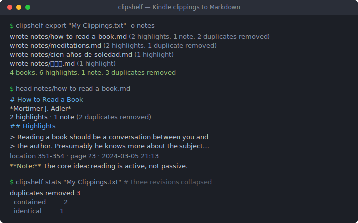
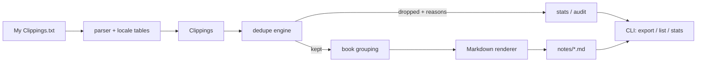

# clipshelf

[English](README.md) | [中文](README.zh.md) | [日本語](README.ja.md)

[](LICENSE) [](CHANGELOG.md) [](pyproject.toml)  [](CONTRIBUTING.md)

**开源的 Kindle 标注解放工具——把 'My Clippings.txt' 转成整洁的按书分档 Markdown 笔记，去除相互重叠的标注修订版本，完全离线。**



```bash
git clone https://github.com/JaydenCJ/clipshelf && cd clipshelf && pip install -e .
```

> **预发布：** clipshelf 尚未发布到 PyPI。在首个正式版本之前，请克隆 [JaydenCJ/clipshelf](https://github.com/JaydenCJ/clipshelf) 并在仓库根目录运行 `pip install -e .`。

## 为什么选 clipshelf？

每台 Kindle 都把你多年的标注存在一个纯文本文件里——而且从不清理。把标注边缘挪一下多圈进一句话，设备就会*追加一条完整的新副本*；改三次，文件里就躺着四条几乎相同的条目。现有的切分脚本只会按 `==========` 分隔符切开文件，把每条过期修订原样搬进你的笔记；Readwise 能解决，但代价是包月订阅加云端上传。clipshelf 把它当作它本来的样子——一个解析问题：按书分组条目，用位置区间重叠加归一化文本包含关系识别修订，只保留最终版本，并输出确定性的 Markdown。你的标注永远不离开你的机器。

|  | clipshelf | Readwise | Clippings.io | 简单切分脚本 |
|---|---|---|---|---|
| 去除相互重叠的标注修订 | 是（离线，可审计原因） | 是（云端处理） | 部分（仅完全相同） | 否 |
| 离线可用 / 数据留在本地 | 是 | 否（上传 + 账号） | 否（上传） | 是 |
| 价格 | 免费，MIT | 每月 $4.49–5.59 | 免费档 + 付费导出 | 免费 |
| 2011 前固件的怪癖（`Loc. 351-52`、罗马数字页码） | 是 | 未说明 | 未说明 | 极少 |
| 一个文件里混合多种设备语言 | 8 种语言一次解析 | 是 | 以英文为主 | 只有英文正则 |
| 运行时依赖 | 0 | SaaS | SaaS | 不一 |

<sub>Readwise 价格为 2026-07 时公布的 Lite/Full 包月价。clipshelf 的依赖数量即 [pyproject.toml](pyproject.toml) 中的 `dependencies = []`。</sub>

## 特性

- **理解修订的去重** — 被延长、被缩短、两端都挪动过的标注，都通过位置重叠 + 归一化文本包含 + 最长公共片段比例折叠为最终版本；每次删除都记录原因（`identical` / `contained` / `revised`）。
- **诚实的存活者选择** — 时间戳决定哪个修订更新；追加顺序作为兜底；只有当时钟证明是刻意的后期缩短时，才会推翻"保留更长文本"的默认。
- **八种设备语言，一次解析** — 英语、西班牙语、法语、德语、意大利语、葡萄牙语、中文、日语的元数据行无需任何参数即可从同一个文件解析，因为真实文件在切换语言后就是混合的。
- **多年的老文件直接可用** — UTF-8 BOM 和 UTF-16 编码、CRLF、2011 前的 `Loc. 351-52` 缩写区间（展开为 `351-352`）、罗马数字页码，以及降级为警告而不是崩溃的损坏条目。
- **笔记归位到它的标注下面** — 锚点落在某条标注位置区间内的笔记，会渲染在那段引文下方，而不是漂浮的孤儿。
- **确定性的 Markdown** — 相同输入，字节级相同输出：按阅读顺序排序、保留 Unicode 的稳定文件名（`こころ.md`）、冲突自动编号；导出结果在 git 里 diff 干净。
- **零运行时依赖** — 纯 Python 标准库；没有网络调用，没有遥测，无需任何配置。

## 快速上手

安装：

```bash
git clone https://github.com/JaydenCJ/clipshelf && cd clipshelf && pip install -e .
```

指向你 Kindle 上的 clippings 文件（例如挂载在 `/media/kindle/documents/`），或先试试自带的示例：

```bash
clipshelf export "examples/My Clippings.txt" -o notes
```

```text
wrote notes/how-to-read-a-book.md (2 highlights, 1 note, 2 duplicates removed)
wrote notes/meditations.md (2 highlights, 1 duplicate removed)
wrote notes/cien-años-de-soledad.md (1 highlight)
wrote notes/こころ.md (1 highlight)
4 books, 6 highlights, 1 note, 3 duplicates removed
```

在信任去重之前先看看它做了什么：

```bash
clipshelf list "examples/My Clippings.txt"
```

```text
TITLE                 HIGHLIGHTS  NOTES  DUPES
How to Read a Book             2      1      2
Meditations                    2      0      1
Cien años de soledad           1      0      0
こころ                            1      0      0
```

以上两段输出均截取自对 [`examples/My Clippings.txt`](examples/) 的真实运行。加 `--no-dedupe` 保留每条原始修订，`--dry-run` 只预览不写盘，`list`/`stats` 加 `--json` 便于脚本处理。

## CLI 参考

| 命令 | 用途 |
|---|---|
| `clipshelf export <file> [-o DIR]` | 每本书写一个 Markdown 文件（默认 `notes/`） |
| `clipshelf list <file>` | 书籍表格，含标注/笔记/重复数量 |
| `clipshelf stats <file>` | 整个文件的总计，重复按原因细分 |

| 参数 | 默认值 | 效果 |
|---|---|---|
| `--no-dedupe` | 关 | 保留每条原始条目，包括相互重叠的修订 |
| `--overlap-ratio R` | `0.6` | 两条重叠标注合并所需的最小共享文本比例 |
| `--book SUBSTRING` | 全部 | 只导出标题包含 SUBSTRING 的书 |
| `--include-bookmarks` | 关 | 在每个文件里加一节 Bookmarks |
| `--no-location` / `--no-date` | 关 | 输出中省略位置编号 / 时间戳 |
| `--dry-run` | 关 | 报告将写入什么，不碰任何文件 |
| `--json` | 关 | `list` 和 `stats` 输出机器可读格式 |

## 去重规则

两条标注只有在位置区间重叠**且**归一化文本相关时才会合并：完全相同、一方包含另一方、或共享片段达到较短文本的 `--overlap-ratio` 比例。区间不相交的永不合并——同一句话在两章各标注一次就是两条标注。笔记是用户自己的话，只去除完全相同的重复；解析器无法归类的条目原样通过。完整规则（包括刻意缩短的例外）见 [docs/clippings-format.md](docs/clippings-format.md)。

## 验证

本仓库不带 CI；上面的每一条声明都由本地运行验证。从本仓库的检出中复现：

```bash
pip install -e '.[dev]' && pytest && bash scripts/smoke.sh
```

输出（复制自真实运行，用 `...` 截断）：

```text
91 passed in 0.51s
...
[export] 4 books, 6 highlights, 1 note, 3 duplicates removed
SMOKE OK
```

## 架构



## 路线图

- [x] 宽容的多语言解析器、折叠修订的去重引擎、确定性的按书 Markdown 导出、`export`/`list`/`stats` CLI（v0.1.0）
- [ ] 发布到 PyPI，支持 `pip install clipshelf`
- [ ] 增量导出：只重写 clippings 有变化的书
- [ ] Org-mode 和 JSON 导出格式
- [ ] 多设备多个 clippings 文件的合并助手

完整列表见 [open issues](https://github.com/JaydenCJ/clipshelf/issues)。

## 参与贡献

欢迎贡献——从一个 [good first issue](https://github.com/JaydenCJ/clipshelf/issues?q=is%3Aissue+is%3Aopen+label%3A%22good+first+issue%22) 开始，或发起一个 [discussion](https://github.com/JaydenCJ/clipshelf/discussions)。开发环境搭建见 [CONTRIBUTING.md](CONTRIBUTING.md)。

## 许可证

[MIT](LICENSE)
